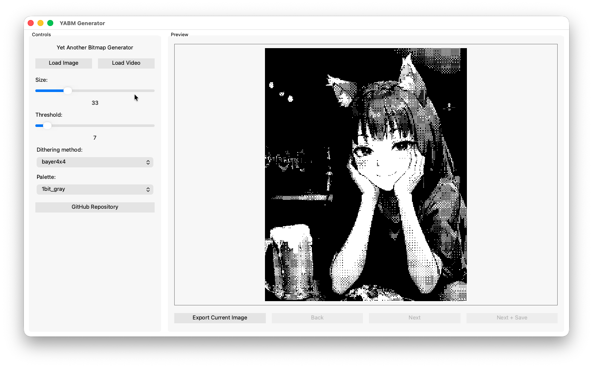
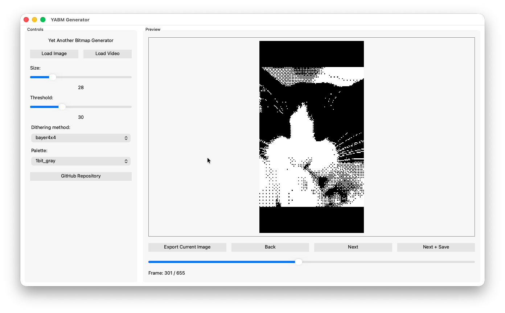
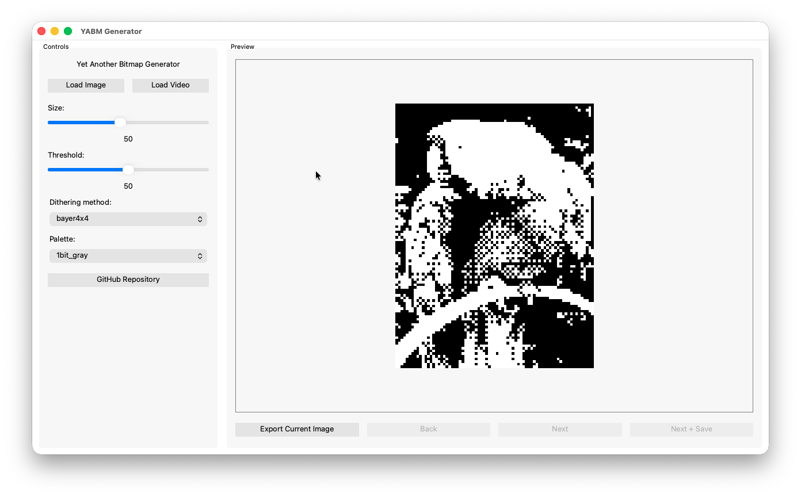

# YABM Generator - Yet Another Bitmap Generator

[Forked from ahota. Thank you!](https://github.com/ahota/dither)

A modern bitmap image generator with support for multiple dithering algorithms and color palettes. Optimized for high-performance processing of large images and videos.

## 🖼️ Screenshots

## 🚀 Features

- **Modern GUI** - Intuitive PyQt6-based interface
- **Multiple Dithering Algorithms** - 4 categories of dithering methods
- **Video Support** - Process video files frame by frame
- **Optimized Performance** - Advanced caching and vectorization
- **Batch Export** - Save multiple processed images
- **Real-time Preview** - Instant preview with adjustable parameters

## 🎨 Supported Dithering Algorithms

### Threshold Methods
- **Threshold** - Basic per-pixel quantization

### Ordered Dithering
- **Bayer 4x4** - Classic Bayer matrix dithering
- **Bayer 8x8** - Higher precision Bayer dithering
- **Cluster 4x4** - Cluster-dot dithering
- **Cluster 8x8** - High-quality cluster dithering

### Error Diffusion
- **Floyd-Steinberg** - Most popular error diffusion
- **Atkinson** - Apple Macintosh classic
- **Burkes** - Floyd-Steinberg optimization
- **Sierra Lite** - Fast error diffusion

### Randomized
- **Random** - Per-pixel randomized quantization
- **Block Random** - Block-based randomized dithering

## 🎯 Available Palettes

- **Grayscale** - 1-bit through 7-bit (2-128 levels)
- **Commodore 64** - Gamma-corrected C64 colors
- **CGA** - Color Graphics Adapter palettes
  - Mode 4, low/high intensity
  - Mode 5, low/high intensity
- **EGA** - Enhanced Graphics Adapter
- **Websafe** - Standard 216 web-safe colors

## 🖥️ Usage

### Basic Controls

- **Load Image/Video** - Import files for processing
- **Size Slider** - Adjust output image scale (10%-100%)
- **Threshold Slider** - Control quantization threshold
- **Dither Method** - Select from available algorithms
- **Palette** - Choose color palette
- **Export** - Save processed images

### Processing Workflow

- Load an image or video file
- Adjust size and threshold parameters
- Select dithering method and palette
- Preview results in real-time
- Export individual frames or batch process

## 📄 License

This project is licensed under the MIT License - see the LICENSE file for details.

## 🤝 Contributing

Contributions are welcome! Please feel free to submit pull requests or open issues for bugs and feature requests.

## 📞 Support

If you encounter any problems or have questions:

1. Check existing GitHub issues
2. Create a new issue with detailed description
3. Include system information and error logs